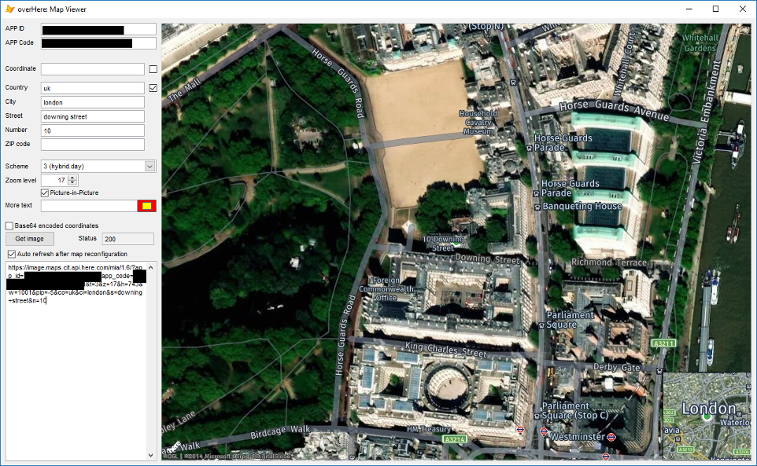
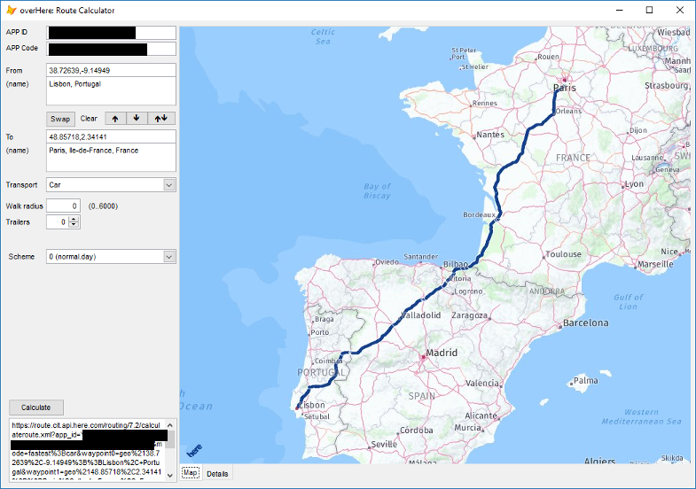
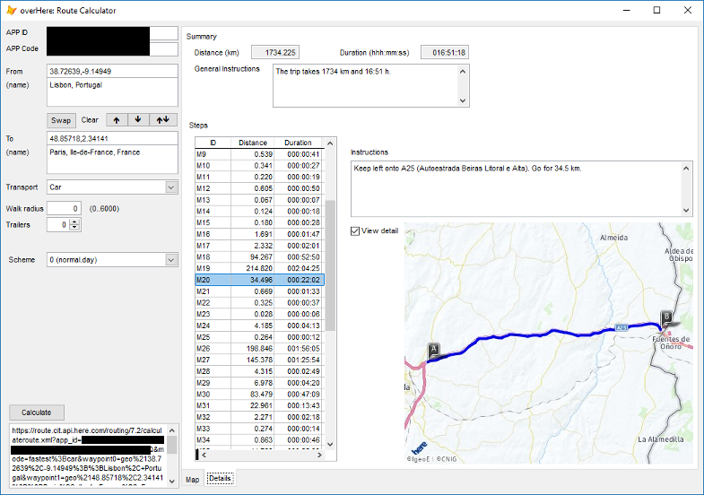

# overHere
## Introduction
overHere is an SDK that wraps access to the [Here.com](https://www.here.com "Here.com") location platform resources for VFP applications. Functionalities like map imagery and enrichment, route calculation, and geocoding, are already available, with others to follow as the SDK keeps growing.

Invoking the services and fetching their responses is done through a set of classes that encapsulate the REST calls to Here.com servers.

Developers using overHere must refer to the Here.com API documentation for implementation details. The overHere documentation will focus on how to set the calls and on how results are structured.

## Getting started

Access to Here.com resources requires registration and, at least, the setting up of a project. See the [Here.com](https://www.here.com "Here.com") website for details.

In the examples folder, a few forms illustrate the use of the SDK.

- `MapViewer.scx`, to display maps of a region
- `Statistics.scx`, to display geolocalized visual data
- `Geocoder.scx`, to search geo coordinate locations
- `Itineraries.scx`, to calculate routes and to display their steps
- `AutoComplete.scx`, to get a list of geocode suggestions.

`Geocoder.scx` may provide information for `MapViewer.scx` and `Itineraries.scx` forms, so it may desirable to keep them open at the same time.

In each one of these forms, the call to Here.com resources can be found in self-contained methods. A developer should read the code in `GetImage()`, `GetLocation()`, `GetRoute()`, and `GetSuggestions()` methods to get a first understanding of the operation of overHere, and to take them as examples of how a VFP application can integrate Here.com resources.

## Quick demo

In this demo, a map of New York is displayed in the VFP main window using the Here.com MapView resource. It can be executed directly from the command window.

**Install the libraries:**

```foxpro
DO LOCFILE("here_api.prg")
DO mapview.prg
```

**Instantiate an overHere API manager and set your credentials:**

```foxpro
m.oh = CREATEOBJECT("overHere")
m.oh.SetCredentials("{APP ID}", "{APP Code}")
```

**Instantiate a MapView object through the API manager:**

```foxpro
m.mv = m.oh.SetResource("MapView")
```

**Set location and map type parameters:**

```foxpro
m.mv.CountryName.Set("USA")
m.mv.CityName.Set("New York")
m.mv.MapScheme.Set(3)
```

**Create an image object in the VFP _Screen:**

```foxpro
_Screen.AddObject("map", "Image")
```

**Fetch the map and load it into the image:**

```foxpro
_Screen.map.PictureVal = m.mv.GetImage(.T.)
```

**Display the image**

```foxpro
_Screen.map.Visible = .T.
```

## Screenshots

A map view centered in 10 Downing St., London. Satellite and traffic displays are combined into a single image. A VFP Image control is used to display the map in the form after it's fetched from Here.com servers.



A route calculated from Lisbon to Paris,



and a segment of the route, when it reaches the Portuguese-Spanish border. The overall distance of the journey is about 1735 km, while this segment has a length of 35 km, approximately.



## Dependencies

Some of the classes depend on `JsonToXML`, a simple Json to XML converter (see [VFP XML library set](https://github.com/atlopes/xml/) GitHub repository for details).

## Status

In development. Unsuited for production. [Unlicensed](docs/UNLICENSE.md "Unlicense").
